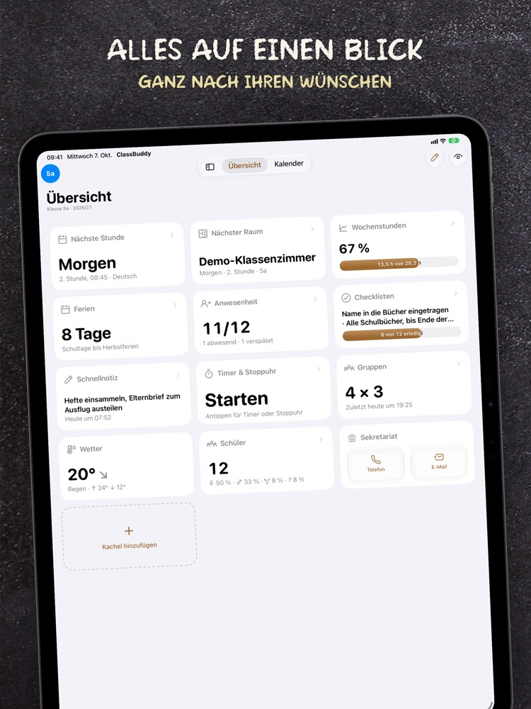
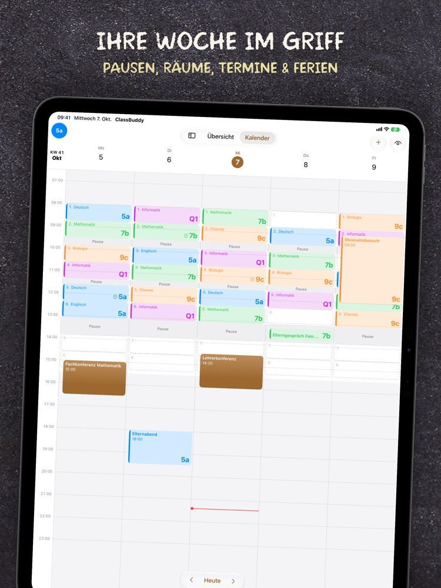
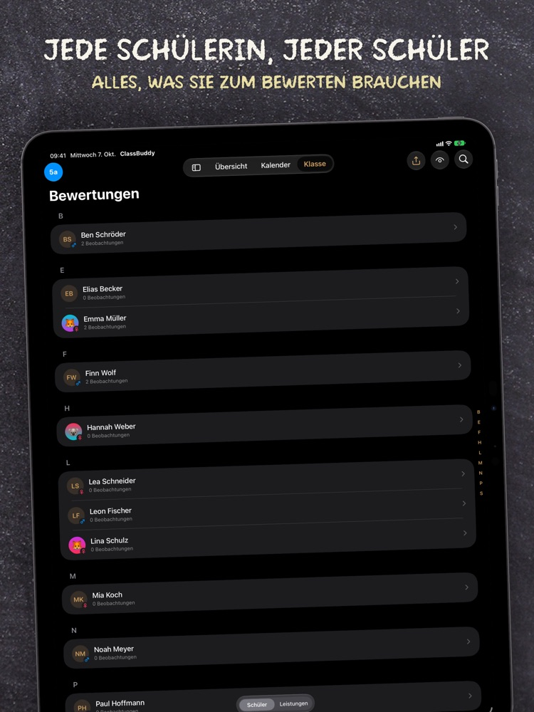
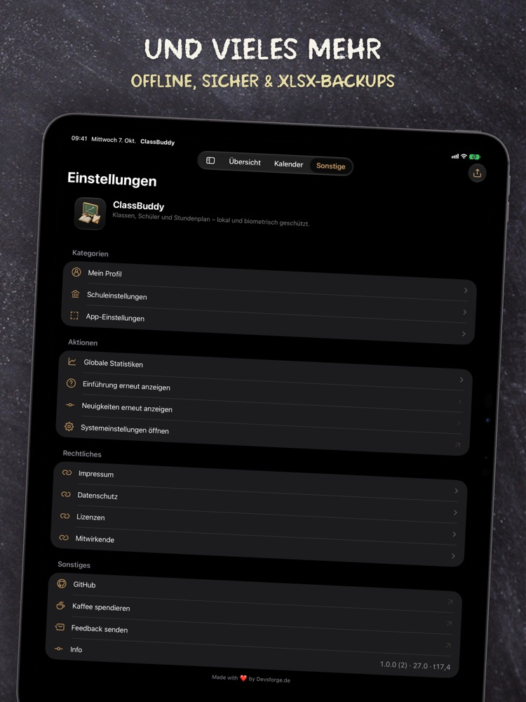
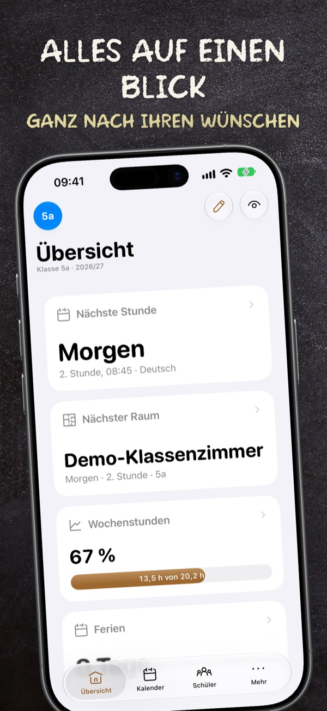
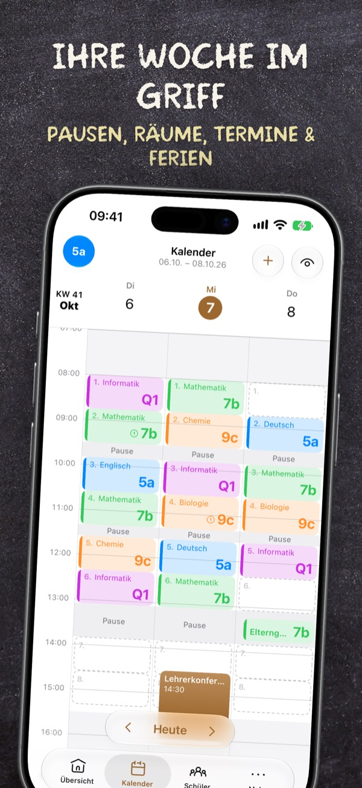
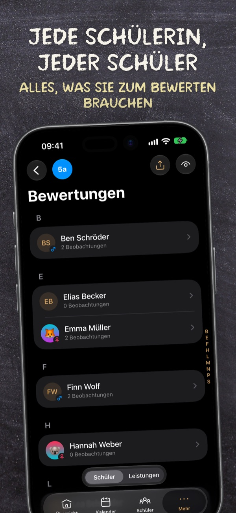
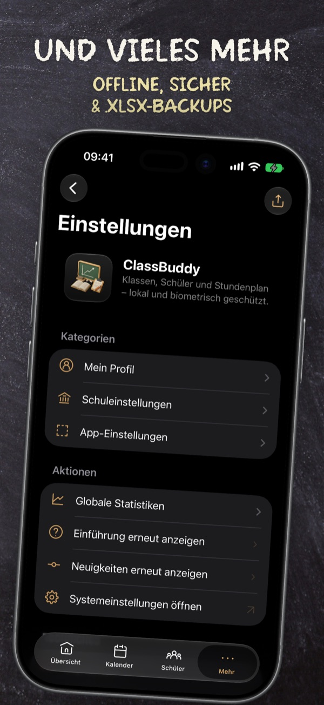

  <picture>
    <source media="(prefers-color-scheme: dark)" srcset="docs/app-icon-dark.png">
    
  </picture>

<h1 align="center">ClassBuddy</h1>

[-85%25-brightgreen)](scripts/coverage.sh)

**ClassBuddy** is a privacy-first classroom companion for teachers on iPad and iPhone.
It keeps your classes, students and timetable in one place — **stored only on your device**,
protected by biometrics (Face ID or Touch ID), with a one-tap privacy mode for when students are looking over your shoulder.

> The app's interface is in **German** (made for teachers in Germany) but the app supports **English** as well.

## Screenshots

  <picture><source media="(prefers-color-scheme: dark)" srcset="docs/screenshots/ipad/01-dashboard-dark.jpg"></picture>
  <picture><source media="(prefers-color-scheme: dark)" srcset="docs/screenshots/ipad/02-calendar-dark.jpg"></picture>
  <picture><source media="(prefers-color-scheme: dark)" srcset="docs/screenshots/ipad/03-notes-dark.jpg"></picture>
  <picture><source media="(prefers-color-scheme: dark)" srcset="docs/screenshots/ipad/04-settings-dark.jpg"></picture>

  <picture><source media="(prefers-color-scheme: dark)" srcset="docs/screenshots/iphone/01-dashboard-dark.jpg"></picture>
  <picture><source media="(prefers-color-scheme: dark)" srcset="docs/screenshots/iphone/02-calendar-dark.jpg"></picture>
  <picture><source media="(prefers-color-scheme: dark)" srcset="docs/screenshots/iphone/03-notes-dark.jpg"></picture>
  <picture><source media="(prefers-color-scheme: dark)" srcset="docs/screenshots/iphone/04-settings-dark.jpg"></picture>

## Features

- **Classes** – short name, school year, colour and multiple subjects per class
- **Students** – A–Z list with search, gender, birthday and notes
- **Dashboard per class** – card gallery with stats, next lesson, current-lesson countdown, next birthday, random student picker, timer, plus your own cards (documents, images, websites with favicon, Shortcuts);
  reorder and hide cards in *Anordnen* mode
- **Weekly calendar** – lesson grid generated from your school's timetable (start, lesson length, breaks),
  weekly or one-off lessons, appointments (optionally per class), class focus mode; 3-day view on iPhone
- **School holidays & public holidays** – imported per German state (via [OpenHolidays API](https://www.openholidaysapi.org))
- **Privacy**
  - Biometric (Face ID / Touch ID) or passcode lock on launch and when returning to the app
  - Privacy mode hides names, grades, notes and more on every page (turning it off needs biometrics or the passcode)
  - Everything is stored locally with SwiftData — no account, no cloud, no tracking
- **Excel export / import** – one sheet per area (classes, students, lessons, appointments, settings, …),
  editable in Excel or Numbers
- iPad and iPhone, light & dark mode, native SwiftUI, no third-party dependencies
- and many more features ...

## Requirements

- iPad with **iPadOS 17.7** or later, or iPhone with **iOS 17.7** or later. iPadOS 26 or iOS 26 and later are recommended for the best experience.

## Installation (sideloading)

ClassBuddy is not yet on the App Store. Every build on GitHub produces an unsigned `.ipa` that you can
sideload yourself using your own Apple ID.

> **Tip:** Make regular backups via *Einstellungen → App-Einstellungen → Exportieren (Excel)*.
> If the app ever expires or gets deleted, the data on the device is lost with it.

## Building from source

1. Xcode 26 or newer
2. `git clone https://github.com/undeaDD/ClassBuddy.git`
3. Copy `Config/Local.example.xcconfig` to `Config/Local.xcconfig` and set your own team, bundle ID
   (and optionally the app name). The file is git-ignored and overrides `Config/Base.xcconfig`;
   widget, tests and the App Group follow the bundle ID automatically
4. Open `ClassBuddy.xcodeproj` and run on your iPad or iPhone

## Privacy & GDPR

ClassBuddy is built for GDPR-compliant use in German schools. The full privacy notice (German) ships with the app:
*Einstellungen → Datenschutz* ([source](ClassBuddy/Resources/Legal/privacy.html)).

**By design**

- No account, no server, no cloud sync, no analytics, no ads, no third-party SDKs
- All data (classes, students, timetable, notes, documents) stays in the app container on the device,
  encrypted by extra iOS/iPadOS data protection when a device passcode is set
- The developer never receives student data; the teacher (or school) is the data controller for everything entered in the app
- App lock via biometrics or passcode, bound to a keychain item released only by the Secure Enclave
- Privacy mode hides names, grades and notes on every screen; content is blurred in the app switcher

**Network requests** (never containing student data; the IP address is transmitted as with any request)

| When | Service | Data sent |
|---|---|---|
| Tap *Ferien & Feiertage importieren* | [openholidaysapi.org](https://www.openholidaysapi.org) | federal state, date range |
| Weather card is visible (max. every 30 min) | Apple Weather (WeatherKit) + Apple Maps | the school's address from the settings, then its coordinates |
| … only if Apple is unreachable, and for the address lookup below iOS 26 | [open-meteo.com](https://open-meteo.com) | the school's town |
| Postal code / town edited in the school settings | Apple Maps (iOS 26 and later), otherwise open-meteo.com | postal code and town (to suggest the federal state) |
| Website card is shown | the website itself | favicon request |
| You send feedback | your mail app | only what you send (plus app and iOS/iPadOS version) |

**Data subject rights, in the app**

- Access & portability (Art. 15/20 GDPR): *Exportieren (Excel)*
- Rectification: edit any entry
- Erasure: delete entries, whole classes, *Alle lokalen Daten löschen*, or the app

**For teachers:** processing student data on a private device may require approval from your school
depending on your federal state. Collect only what you need, keep the app lock enabled and store Excel exports securely. (Not legal advice.)

## Contributing

Issues and pull requests are welcome — see [CONTRIBUTING.md](CONTRIBUTING.md) and our [Code of Conduct](CODE_OF_CONDUCT.md).
Security issues: please follow [SECURITY.md](SECURITY.md).

## Support

**Schools:** codes for the full version are available in larger quantities. Just ask via *Feedback senden* in the app
(Settings) or by [email](mailto:dominic.drees@live.de?subject=ClassBuddy%20codes%20for%20schools).

If ClassBuddy saves you time, you can support development via [PayPal](https://www.paypal.com/paypalme/undeaDD). ❤️

## License

Source-available under the [PolyForm Strict License 1.0.0](LICENSE): you may read the code, but not copy, modify or redistribute it.

© Dominic Drees · Made with ❤️ by [Devsforge.de](https://devsforge.de)
