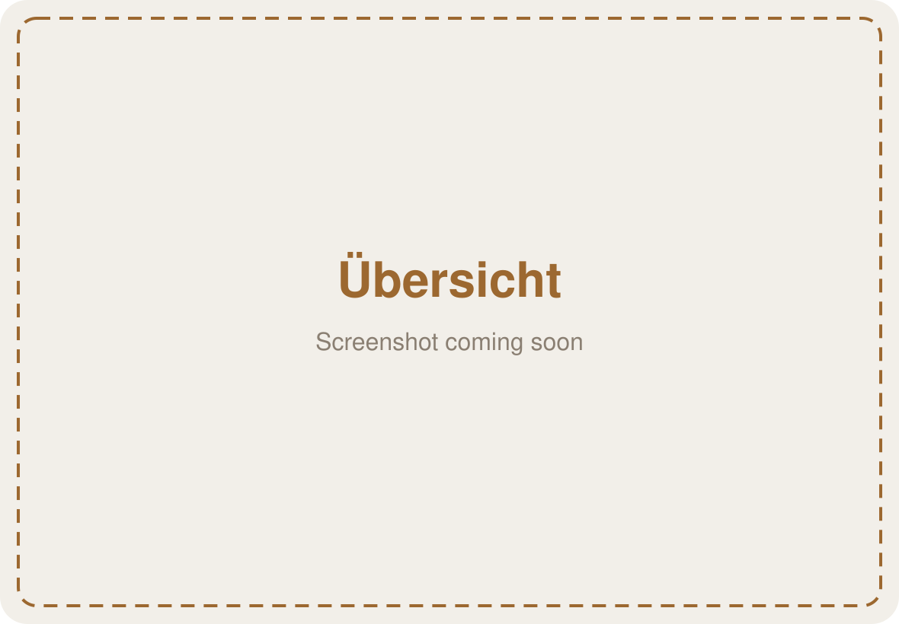
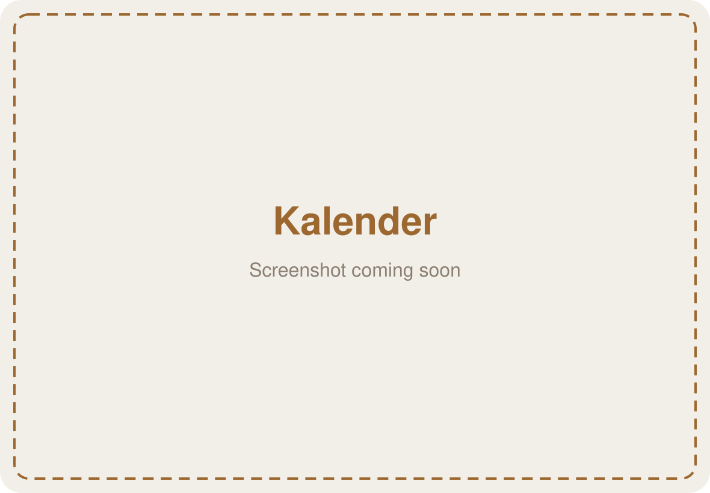
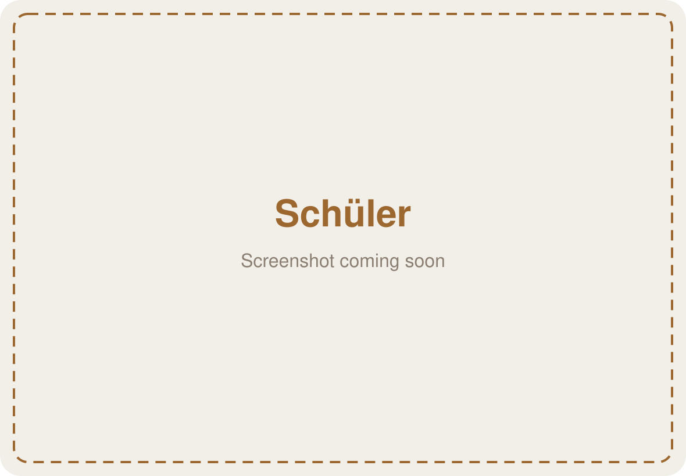
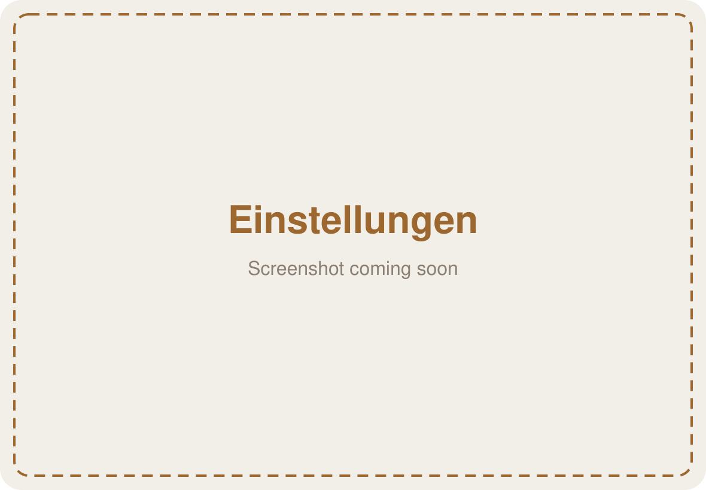

# ClassBuddy

[](https://github.com/undeaDD/ClassBuddy/actions/workflows/build-ipa.yml)
[](https://github.com/undeaDD/ClassBuddy/releases/latest)
[](https://github.com/undeaDD/ClassBuddy/releases)


[](LICENSE)

**ClassBuddy** is a privacy-first classroom companion for teachers on the iPad.
It keeps your classes, students and timetable in one place — **stored only on your device**,
protected by Face ID, with a one-tap privacy mode for when students are looking over your shoulder.

> The app's interface is in **German** (made for teachers in Germany).

## Screenshots

| Übersicht | Kalender |
|---|---|
|  |  |

| Schüler | Einstellungen |
|---|---|
|  |  |

## Features

- **Classes** – short name, school year, colour and multiple subjects per class
- **Students** – A–Z list with search, gender, birthday and notes
- **Dashboard per class** – card gallery with stats, next lesson, current-lesson countdown, next birthday, random student picker, timer, plus your own cards (documents, images, websites with favicon);
  reorder and hide cards in *Anordnen* mode
- **Weekly calendar** – lesson grid generated from your school's timetable (start, lesson length, breaks),
  weekly or one-off lessons, appointments, class focus mode
- **School holidays & public holidays** – imported per German state (via [OpenHolidays API](https://www.openholidaysapi.org))
- **Privacy**
  - Face ID / passcode lock on launch and when returning to the app
  - Privacy mode hides names, grades, notes and more on every page (turning it off needs Face ID)
  - Everything is stored locally with SwiftData — no account, no cloud, no tracking
- **Excel export / import** – one sheet per area (classes, students, lessons, appointments, settings, …),
  editable in Excel or Numbers
- **Apple Pencil** – squeeze for a radial quick menu at the pencil's position, double-tap toggles privacy mode
- Light & dark mode, native SwiftUI, no third-party dependencies

## Requirements

- iPad with **iPadOS 26** or later

## Installation (sideloading with AltStore)

ClassBuddy is not on the App Store. Every build on GitHub produces an unsigned `.ipa` that you can
install with [AltStore](https://altstore.io) using your own (free) Apple ID.

### 1. Install AltServer on your computer

1. Download **AltServer** from [altstore.io](https://altstore.io) for macOS or Windows and start it.
2. **Windows only:** install iTunes and iCloud from Apple's website (not the Microsoft Store versions).

### 2. Install AltStore on your iPad

1. Connect your iPad via USB (or the same Wi-Fi with Wi-Fi sync enabled) and trust the computer.
2. Click the AltServer icon in the menu bar / system tray → **Install AltStore** → select your iPad.
3. Sign in with your Apple ID (it's only sent to Apple).
4. On the iPad: **Settings → General → VPN & Device Management** → trust your Apple ID.
5. Enable **Developer Mode**: **Settings → Privacy & Security → Developer Mode**, then restart.

### 3. Install ClassBuddy

1. On the iPad, open the [latest release](https://github.com/undeaDD/ClassBuddy/releases/latest) in Safari
   and download **`ClassBuddy.ipa`**.
2. Open **AltStore → My Apps → `+`** and pick `ClassBuddy.ipa` from *Downloads*.
3. Wait until the installation finishes — ClassBuddy appears on your home screen.

### 4. Keep it running

- Apps signed with a free Apple ID expire after **7 days**. AltStore refreshes them automatically in the
  background while AltServer is running on the same network — or tap **Refresh All** in AltStore.
- Free Apple IDs are limited to 3 sideloaded apps at a time.
- **Updates:** download the new `.ipa` and install it the same way; your data is kept.

> **Tip:** Make regular backups via *Einstellungen → App-Einstellungen → Exportieren (Excel)*.
> If the app ever expires or gets deleted, the data on the device is lost with it.

Alternatively, [SideStore](https://sidestore.io) works the same way without a computer after the initial setup.

## Building from source

1. Xcode 26 or newer
2. `git clone https://github.com/undeaDD/ClassBuddy.git`
3. Open `ClassBuddy.xcodeproj`, choose your team under *Signing & Capabilities*
4. Run on your iPad

Unsigned build like the CI:

```bash
xcodebuild -project ClassBuddy.xcodeproj -target ClassBuddy -configuration Release -sdk iphoneos SYMROOT="$PWD/build" CODE_SIGNING_ALLOWED=NO build
```

## Privacy

ClassBuddy has no server. All data stays in the app's local storage on your iPad.
The only network requests are:

- public school/public holiday dates from openholidaysapi.org (only when you tap *import*)
- favicons of websites you add as dashboard cards (requested from that website)

## Contributing

Issues and pull requests are welcome — see [CONTRIBUTING.md](CONTRIBUTING.md).
Security issues: please follow [SECURITY.md](SECURITY.md).

## Support

If ClassBuddy saves you time, you can support development via [PayPal](https://www.paypal.com). ❤️

## License

[MIT](LICENSE) © Dominic Drees · Made with ❤️ by [Devsforge.de](https://devsforge.de)
